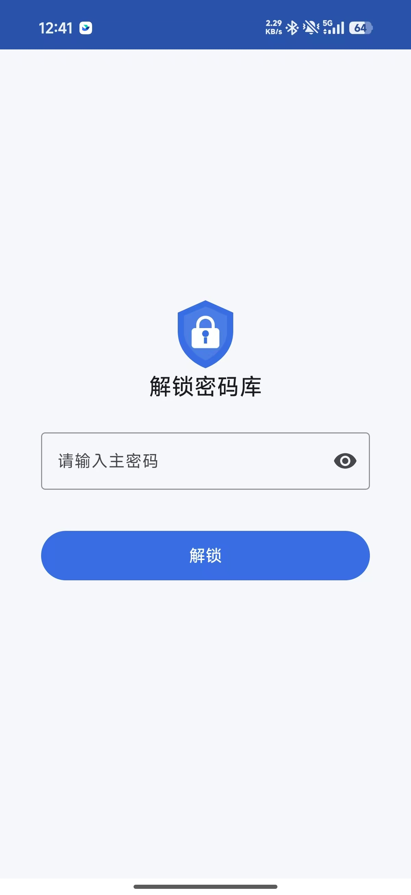
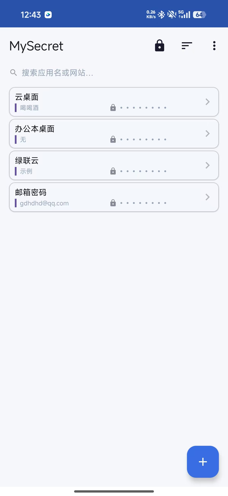
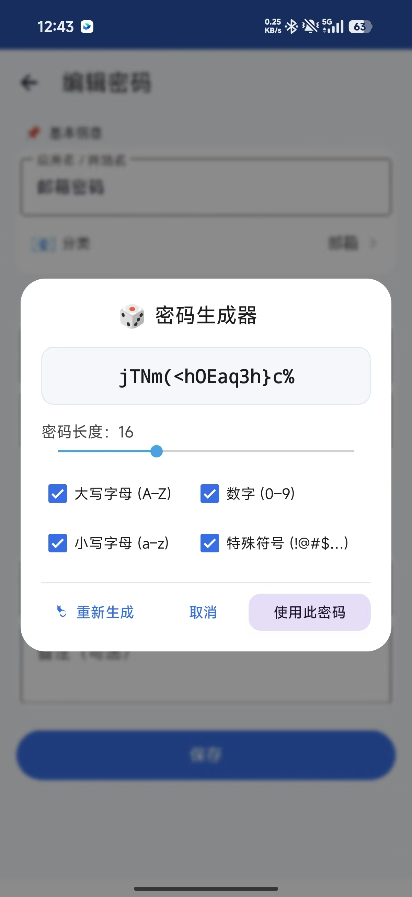
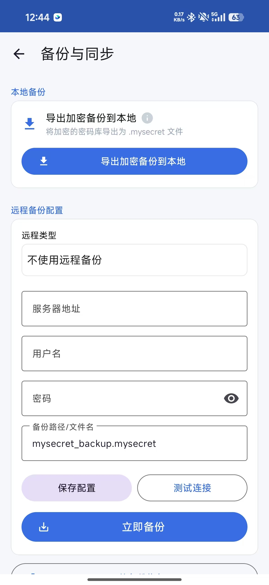

<div align="center">

# 🔐 MySecret

**一款注重隐私的本地密码管理器**  
A privacy-first, fully offline password manager for Android.

[](https://www.android.com)
[](https://kotlinlang.org)
[-00A1C2?logo=android&logoColor=white)](https://developer.android.com/about/dashboards)
[](./LICENSE)
[](#-安全设计)

**🔒 所有数据加密存储在本地 · 📡 无后端 · 🚫 不收集任何数据**

</div>

---

## 📖 简介 / Overview

MySecret 是一款**完全离线**的 Android 密码管理器。所有密码使用 **AES-256-GCM** 加密后存储在设备本地私有目录，主密码不存储、不传输、无法被任何人获取——包括开发者本人。

> 适合那些不信任云端密码管理器、希望完全掌控自己数据的用户。

### ✨ 核心特性

| 特性 | 说明 |
|------|------|
| 🔐 **AES-256-GCM 加密** | 密码库使用 AES-256-GCM 加密，密钥由主密码经 PBKDF2-HMAC-SHA256（**210,000 次迭代**）派生 |
| 📋 **分类管理** | 自定义分类、emoji 图标、颜色标识，支持按分类筛选 |
| 🔍 **即时搜索** | 实时搜索应用名、用户名、密码、网址、备注 |
| 🎲 **密码生成器** | 可配置长度（8–32）、字符集，一键生成强密码 |
| 📋 **安全剪贴板** | 复制后 30 秒自动清除，防止密码残留 |
| 🔒 **自动锁定** | 应用退到后台立即锁定，返回需重新输入主密码 |
| 💾 **本地备份** | 导出加密的 `.mysecret` 备份文件到本地 |
| 🌐 **远程备份** | 支持 **WebDAV** 和 **SMB/Samba**，一键备份到自己的 NAS/网盘 |
| 🔄 **备份恢复** | 从 `.mysecret` 文件恢复密码库 |
| 🌙 **深色模式** | 跟随系统暗色模式 |
| 🌍 **双语界面** | 中文 / English |

---

## 🔒 安全设计

```
主密码 ──PBKDF2(SHA256, 210000次)──→ AES-256 密钥
                                        │
密码库 JSON ──AES-256-GCM加密──→ vault.enc 文件（本地私有目录）
```

**文件格式**：`salt(16字节) | iv(12字节) | iterations(4字节) | 密文+GCM认证标签`

- 🔑 **主密码不存储**：仅存储加密验证令牌用于校验
- 🔁 **每次保存使用全新随机 salt 和 iv**，永不复用
- 🛡️ **GCM 模式**提供机密性 + 完整性认证，篡改即解密失败
- 🧠 **内存安全**：主密码以 `CharArray` 持有，使用后立即清零
- 📱 **应用私有目录**：其他应用无法读取
- 🚫 **`allowBackup=false`**：防止通过 ADB 备份泄露
- 🔌 **无任何统计 / 广告 / 崩溃上报 SDK**

> ⚠️ **主密码无法找回**。遗忘后所有数据不可恢复，这是安全设计的代价。

详见 [隐私政策](https://gggwb.github.io/mysecret-privacy/)。

---

## 📱 截图 / Screenshots

<table>
  <tr>
    <td width="50%" align="center"><b>🔐 解锁页</b><br/>输入主密码进入密码库</td>
    <td width="50%" align="center"><b>📋 主列表</b><br/>卡片式密码列表，支持搜索 / 分类 / 排序</td>
  </tr>
  <tr>
    <td width="50%" align="center"></td>
    <td width="50%" align="center"></td>
  </tr>
  <tr>
    <td width="50%" align="center"><b>🎲 密码生成器</b><br/>可配置长度与字符集</td>
    <td width="50%" align="center"><b>💾 备份页</b><br/>本地导出 / WebDAV / SMB 远程备份</td>
  </tr>
  <tr>
    <td width="50%" align="center"></td>
    <td width="50%" align="center"></td>
  </tr>
</table>

---

## 🚀 下载 / Download

### 📦 直接下载 APK（推荐，无需 Google Play）

👉 [**MySecret-1.0.apk**](https://github.com/GGGWB/mysecret/releases/download/v1.0.0/MySecret-1.0.apk)（5.3 MB · 已签名）

或前往 [Releases 页面](https://github.com/GGGWB/mysecret/releases) 查看所有版本。

> 适合没有 Google Play 服务、或不想注册账号的用户。下载后直接安装即可。
>
> ⚠️ 首次安装时 Android 会提示"未知来源"，请允许安装。

### 🏪 Google Play
<!-- TODO: 上架后补充商店链接 -->

### 🔧 从源码自行构建
```bash
git clone https://github.com/GGGWB/mysecret.git
cd mysecret
./gradlew assembleDebug
# APK 输出：app/build/outputs/apk/debug/app-debug.apk
```

### 🔐 完整性校验（可选）
下载后可用 SHA-256 校验文件完整性，确保未被篡改：
```bash
shasum -a 256 MySecret-1.0.apk
# 应输出：507eefbbf6d92476de6ae6904a39d62ab9ff0318326a585e9add718c7623d371
```

---

## 🛠 技术栈

- **语言**：Kotlin
- **UI**：Material Design 3 + ViewBinding
- **存储**：本地加密文件（Gson 序列化）
- **加密**：Javax.Crypto（AES-256-GCM + PBKDF2）
- **异步**：Kotlin Coroutines
- **构建**：Gradle 8.9 + AGP 8.7
- **网络**：OkHttp 4.12（WebDAV）、jcifs-ng 2.1.39（SMB）

| 最低配置 | 版本 |
|---|---|
| minSdk | 24（Android 7.0） |
| targetSdk | 35（Android 15） |
| Java | 17 |

---

## 📂 项目结构

```
my_secret/
├── app/src/main/
│   ├── java/com/mysecret/
│   │   ├── MySecretApp.kt              # Application 入口（后台锁定）
│   │   ├── data/
│   │   │   ├── model/                  # 数据模型（Credential/Vault/Category）
│   │   │   ├── VaultRepository.kt      # 加密文件读写
│   │   │   ├── PrefsManager.kt         # 非敏感配置
│   │   │   ├── BackupConfigManager.kt  # 远程备份配置（加密存储）
│   │   │   └── SessionManager.kt       # 会话状态
│   │   ├── security/
│   │   │   ├── CryptoVault.kt          # 🔐 加密核心
│   │   │   ├── PasswordGenerator.kt    # 密码生成器
│   │   │   └── SecureClipboard.kt      # 安全剪贴板
│   │   ├── backup/
│   │   │   ├── BackupManager.kt
│   │   │   ├── WebDavClient.kt
│   │   │   └── SmbClient.kt
│   │   └── ui/                         # unlock/main/editor/backup
│   └── res/                            # 布局/资源（含 values-en 英文）
├── PRIVACY_POLICY.md
├── CONTRIBUTING.md
└── LICENSE
```

---

## 🤝 贡献 / Contributing

欢迎提交 Issue、Pull Request，甚至修正一个 typo 都非常有价值！

详见 [CONTRIBUTING.md](./CONTRIBUTING.md)。

---

## ❤️ 支持这个项目 / Support

MySecret 是**完全免费且开源**的，没有任何广告或变现。如果它对你有帮助，欢迎请开发者喝杯咖啡 ☕

💛 **爱发电（爱发电 · 推荐国内用户）**：[https://afdian.com/a/gggwb](https://afdian.com/a/gggwb)

> ⭐ 给项目点个 Star 也是对开发者最大的鼓励！

---

## 📄 License

[MIT License](./LICENSE) © 2026 GGGWB

本应用使用的第三方库（OkHttp、jcifs-ng、Gson、Material Components 等）均保留其原始许可证。
